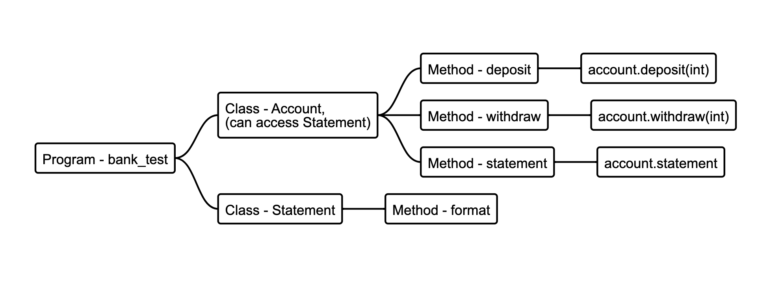

# Bank tech test

## Specification

### Requirements

* You should be able to interact with your code via a REPL like IRB or the JavaScript console.  (You don't need to implement a command line interface that takes input from STDIN.)
* Deposits, withdrawal.
* Account statement (date, amount, balance) printing.
* Data can be kept in memory (it doesn't need to be stored to a database or anything).

### Acceptance criteria

**Given** a client makes a deposit of 1000 on 10-01-2012  
**And** a deposit of 2000 on 13-01-2012  
**And** a withdrawal of 500 on 14-01-2012  
**When** she prints her bank statement  
**Then** she would see

```
date || credit || debit || balance
14/01/2012 || || 500.00 || 2500.00
13/01/2012 || 2000.00 || || 3000.00
10/01/2012 || 1000.00 || || 1000.00
```

# Domain Modelling

<br>
<p align="center">

<br><br>
  Domain model.
</p>

## User stories

```
As a customer
So that I can protect my money
I want to be able to deposit funds in an account
```
```
As a customer
So that I can spend my money
I want to be able to withdraw funds in an account
```
```
As a customer
So that I can manage my money
I would like to be able to print a nicely formatted statement
```

## IRB Spark
```
require './lib/account.rb'
acc = Account.new
acc.deposit(1000)
acc.deposit(2000)
acc.withdraw(500)
```
